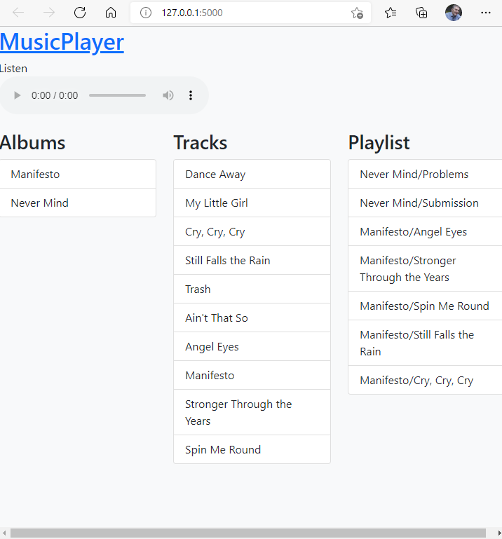

# ECM3432-agile

## Agile development exercise 

Prepare for the next development iteration of the ```musicplayer``` web app.

To run the program see the instructions here [demo/README.md](demo/README.md)



### Consider these user stories

* As a user I want to save playlists

* As a user I want to share my playlists

* As a user I want to play playlists shared with me

### How would you go about designing these features?

### Which would you implement first?

### What skills and knowledge will this require?

### Where would you find what you need to know?

